# sas-teams-webhook
Repository containing assets for project involving Github API, SAS, and a Mircrosoft Teams webhook.
Process involves SAS program that makes API call to GitHub (GET request using PROC  HTTP) and pulls out desired information for a timeframe of interest from the output of said API call. Then the program makes a POST call to a webhook configured in Microsoft Teams Team channel. The webhook posts a Teams card with information regarding activity for this repository.

The information posted includes the list of contributors, the number of pushes, the number of issues raised, and the number of additional events that occurred. Moreover, a list of the commit messages and issue titles is included as well. Information included on this card may be adjusted over time, and anyone who downloads the assets for this project can make changes as they wish.

More specific explanation of the program is included in the CODE folder that outlines how to use the program itself, the macro variables, and some ideas on how you could alter the program. Below is an outline of the steps you should do prior to working with the program along with additional resources that were helpful in putting this project together.

This README, the code README, the program itself, and repository content will always be updated as things change in order to ensure this project works and the information provided about how to use it is accurate. If there are any issues with the code, please feel free to consult the resources included below or reach out to me directly.

# Prerequisites

## Configuring Webhook for a Teams Channel
1. Go to the teams channel you want to have the webhook for (or create the Team and/or channel).  
    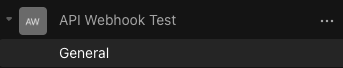
2. Right-click the channel and select "Connectors" from the menu.  
    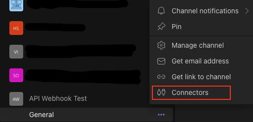
4. Search for the "Incoming Webhook" connector and select "Configure".  
    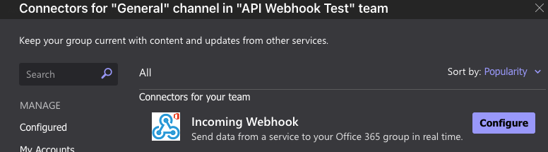
5. Provide a name for the webhook, an image (can also just use the default), and select "Create".  
    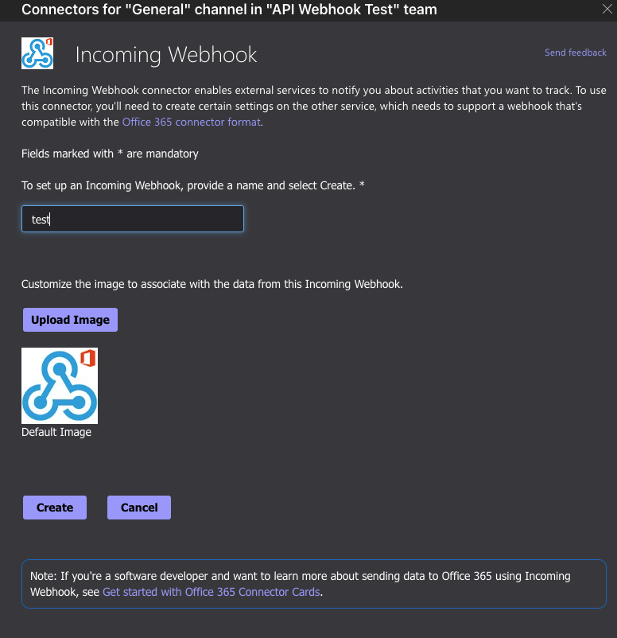
6. You should get a URL for your webhook, this will be used in the SAS program for the POST Call.  
    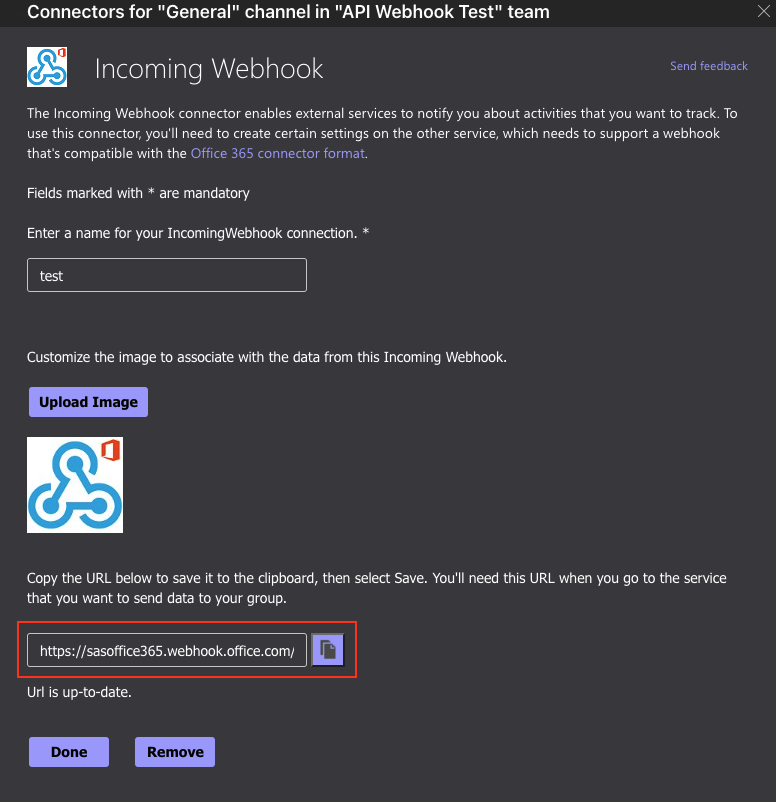
7. Note that if you need to get this URL, you can go back to the connectors menu for the channel and select the "Configured" drop-down. You should see the webhook you just configured and now you can click "Manage" to see information about this webhook, including the URL.  
    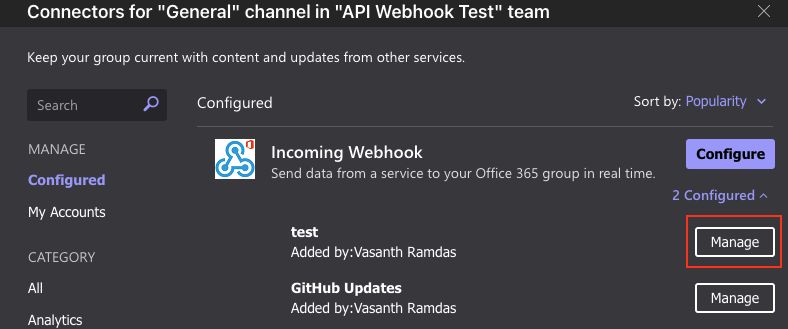  
    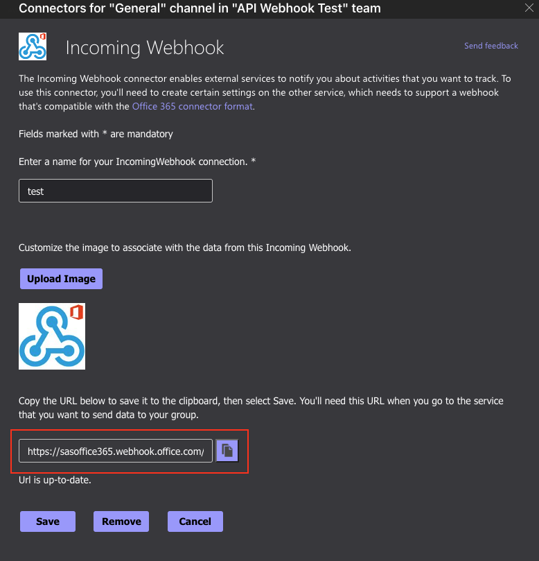

## Generating a GitHub Token
1. Go to GitHub, select your profile, and go to settings.  
    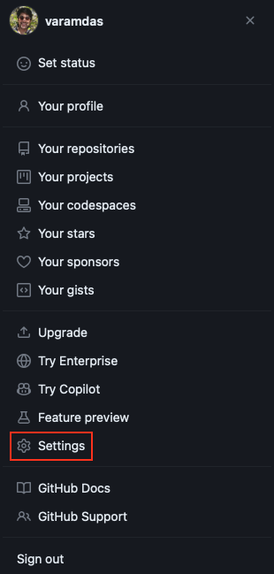
2. Under the settings, go to "Developer Settings".  
    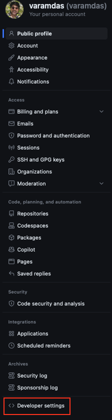
3. In Developer Settings, select the "Personal Access Tokens" dropdown.  
    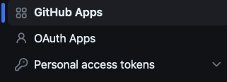
4. From the options, select the token type. For this project the classic Tokens were used, but you are free to try the other token option.
5. Select the "Generate new token" button and select the token option (once again, the classic approach was used for this project).  
    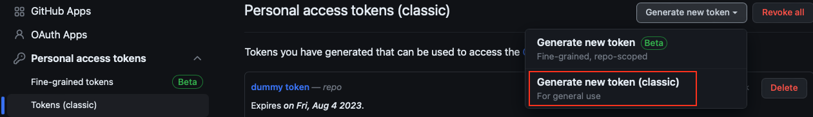
6. Provide a name for the token, an expiration window, and scopes (repo is all you need for this project). Then click "Generate Token".  
    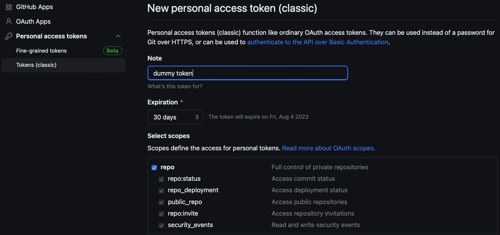
7. Copy the resulting token and put it somewhere safe for use with the SAS program, you will not be able to see the token again!  
    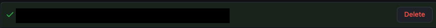

# Information Displayed

# Resources
- [SAS blog post about SAS and Teams webhooks](https://blogs.sas.com/content/sasdummy/2019/09/05/sas-microsoft-teams/)
- [Microsoft article on creating webhooks in Teams](https://learn.microsoft.com/en-us/microsoftteams/platform/webhooks-and-connectors/how-to/add-incoming-webhook?tabs=dotnet)
- [Teams Message Card Playground for developing cards](https://messagecardplayground.azurewebsites.net)
- [GitHub API Documentation](https://docs.github.com/en/rest?apiVersion=2022-11-28)
- [PROC HTTP Documetnation](https://go.documentation.sas.com/doc/en/pgmsascdc/9.4_3.5/proc/n0t7v16eitluu2n15ffpfeafqszs.htm)
- [SAS Communities](https://communities.sas.com)
