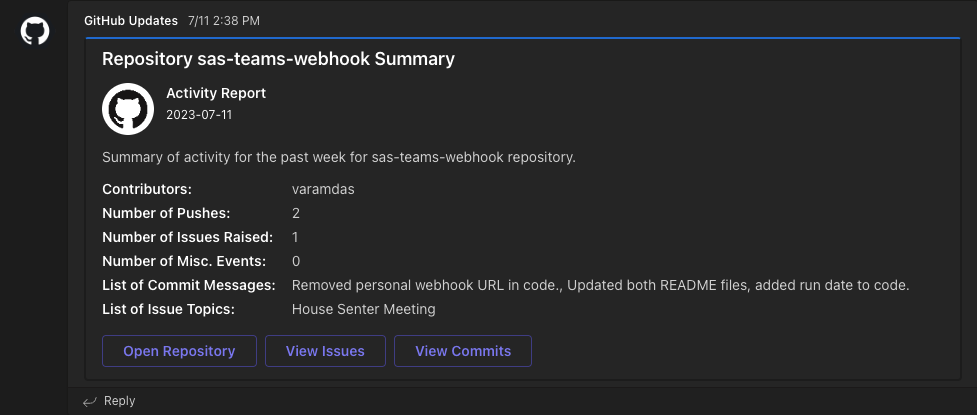

# sas-teams-webhook
Last Updated: 12/8/2023

# Table of Contents
1. [About](https://github.com/varamdas/sas-teams-webhook/blob/main/README.md#about)  
2. [Information Displayed](https://github.com/varamdas/sas-teams-webhook/blob/main/README.md#information-displayed)  
3. [Prerequisites](https://github.com/varamdas/sas-teams-webhook/blob/main/README.md#prerequisites)   
    3a. [Configuring Webhook](https://github.com/varamdas/sas-teams-webhook/blob/main/README.md#configuring-webhook-for-a-teams-channel)    
    3b. [Generating GitHub Tokens](https://github.com/varamdas/sas-teams-webhook/blob/main/README.md#generating-a-github-token)  
4. [Notes about Use of Repository Assets](https://github.com/varamdas/sas-teams-webhook/blob/main/README.md#notes-about-use-of-repository-assets)    
5. [Resources](https://github.com/varamdas/sas-teams-webhook/blob/main/README.md#resources)  
6. [Contributors](https://github.com/varamdas/sas-teams-webhook/blob/main/README.md#contributors)  

# About
Repository containing assets for project involving Github API, SAS, and a Mircrosoft Teams webhook.
Process involves SAS program that makes API call to GitHub (GET request using PROC  HTTP) and pulls out desired information for a timeframe of interest from the output of said API call. Then the program makes a POST call to a webhook configured in a Microsoft Teams team channel. The webhook posts a Teams card with information regarding activity for the repository.

More specific explanation of the program is included in the CODE folder that outlines how to use the program itself, the macro variables, implementing the program into a workflow, and some ideas on how one could alter the program for other uses. Below is an outline of the steps that one should do prior to working with the program along with additional resources that were helpful in putting this project together.

This README, the code README, the program itself, and repository content will always be updated as things change in order to ensure this project works and the information provided about how to use it is accurate. If there are any issues with the code, please feel free to consult the resources included below or reach out to me directly.

# Information Displayed
Information displayed in Teams using the program in this repository includes: Contributors to the repository, Number of pushes, Number of issues raised, Number of other events, List of commit messages, and a List of Issue topics. Clickable buttons linking to the repository, issues, and commits pages of the repository are included as well. Information included on this card may be adjusted over time, and anyone who pulls the assets for this project can make changes as they wish.

# Prerequisites
Please ensure you do the below steps before moving on to reading about and using the provided code. Use of the program requires users to have either SAS Viya (3.5 or 4) or SAS 9.4.

## Configuring Webhook for a Teams Channel
1. Go to the Microsoft Teams channel you want to have the webhook for (or create the team and/or channel).  
    
2. Right-click the channel and select "Connectors" from the menu.  
    
4. Search for the "Incoming Webhook" connector and select "Configure".  
    
5. Provide a name for the webhook, an image (can also just use the default), and select "Create".  
    
6. You should get a URL for your webhook, this will be used in the SAS program for the POST Call.  
    
7. Note that if you need to get this URL, you can go back to the connectors menu for the channel and select the "Configured" drop-down. You should see the webhook you just configured and now you can click "Manage" to see information about this webhook, including the URL.  
      
    

## Generating a GitHub Token
1. Go to GitHub, select your profile, and go to settings.  
    
2. Under the settings, go to "Developer Settings".  
    
3. In Developer Settings, select the "Personal Access Tokens" dropdown.  
    
4. From the options, select the token type. For this project the classic Tokens were used, but you are free to try the other token option.
5. Select the "Generate new token" button and select the token option (once again, the classic approach was used for this project).  
    
6. Provide a name for the token, an expiration window, and scopes (repo is all you need for this project). Then click "Generate Token".  
    
7. Copy the resulting token and put it somewhere safe for use with the SAS program, you will not be able to see the token again!  
    

# Notes about Use of Repository Assets
For use, feel free to take the code provided in this repository and use it and make changes as you wish. It is recommended you refer to a repository you work with consistently to get the most value out of this code. Make sure the repository you use this code with is one you have access to. For Microsoft Teams, ensure that you have the ability to create Teams channels and configure them. You might need to consult with GitHub repo owners and your IT team if there are any access issues.

# Resources
- [SAS blog post about SAS and Teams webhooks](https://blogs.sas.com/content/sasdummy/2019/09/05/sas-microsoft-teams/)
- [Microsoft article on creating webhooks in Teams](https://learn.microsoft.com/en-us/microsoftteams/platform/webhooks-and-connectors/how-to/add-incoming-webhook?tabs=dotnet)
- [Teams Message Card Playground for developing cards](https://messagecardplayground.azurewebsites.net)
- [GitHub API Documentation](https://docs.github.com/en/rest?apiVersion=2022-11-28)
- [PROC HTTP Documetnation](https://go.documentation.sas.com/doc/en/pgmsascdc/9.4_3.5/proc/n0t7v16eitluu2n15ffpfeafqszs.htm)
- [JSON Data in SAS](https://communities.sas.com/t5/Ask-the-Expert/How-to-use-JSON-data-in-SAS-Q-amp-A-and-on-demand-recording/ta-p/878508)
- [SAS Communities](https://communities.sas.com)

# Contributors
Vasanth Ramdas  
